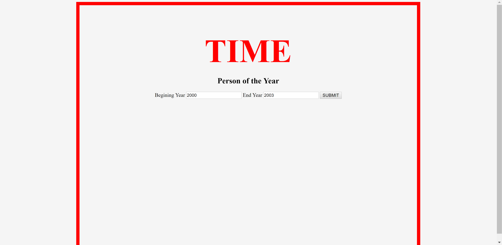
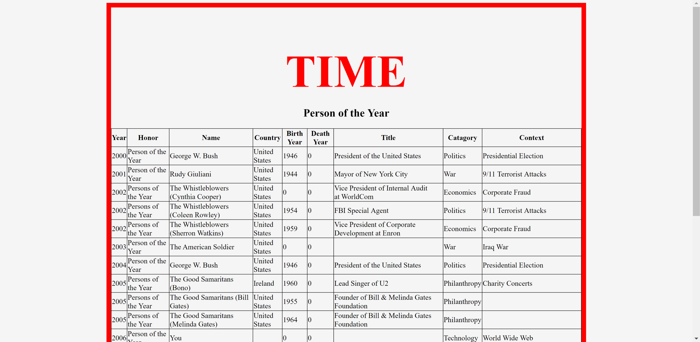

# Lab07-MVC
Create a web app that will allow a user to put in a span of 2 different years, and a list of all the winners will be returned.
Technologies I used in this lab are ASP.net Core MVC, LINQ(used to filter results from a CSV file), and System.IO.

# installation when not deployed
To run you need Visual Studio 2017, navigate to /WebApp/WebApp/Program.cs open with Visual Studio 2017 then press Ctrl+F5 to compile and run, or click the green arrow on the top toolbar.

# Visuals
Home Page:

 
Results Page:

